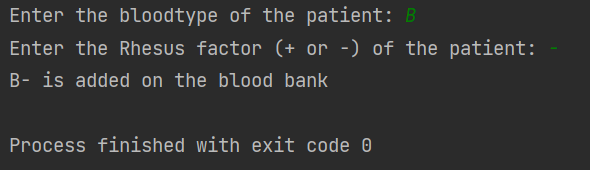

<p align="center">
  
</p>

<h1 align="center">BloodData</h1>

<p align="center">
  <a href="#project-description">Project Description</a> • 
  <a href="#features">Features</a> • 
  <a href="#tech-stack">Tech Stack</a> • 
  <a href="#installation">Installation</a> • 
  <a href="#usage">Usage</a>
</p>

<p align="center">
  
</p>
---

## Project Description

**BloodData** is a Java console application created as a **university lab exercise**.  
It simulates storing and displaying a patient’s blood type and Rhesus factor, practicing concepts such as **constructors, method overloading, input validation, and object instantiation**.  

---

## Features

- Default blood type (`O+`) if no input is provided  
- Overloaded constructor to accept user-defined blood type and Rh factor  
- Input validation for valid blood groups (`O, A, B, AB`) and Rh factor (`+` or `-`)  
- Console-based interface with feedback for invalid inputs  

---

## Tech Stack

- **Language**: Java  
- **IDE**: IntelliJ IDEA (or any Java IDE)  

---

## Installation

```bash
git clone https://github.com/nca-gabriel/BloodData.git
cd BloodData
``` 
---
## Usage
Compile & Run via CLI:
cd src
java Main.java
java Main

Run via IntelliJ IDEA:

Open the project in IntelliJ IDEA

Right-click Main.java → Run 'Main.main()'

